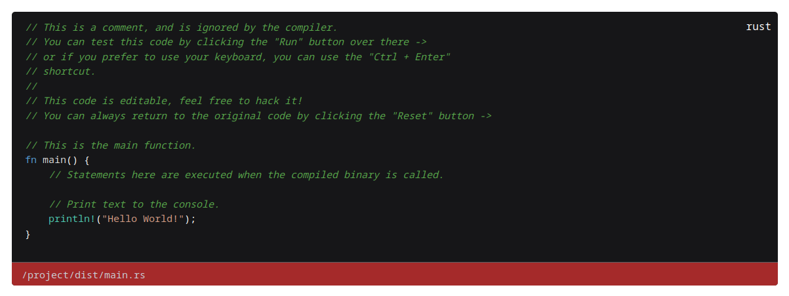

# magic-code-editor

Simple, beautiful and highly customizable code blocks for Vue 3.

Github: https://github.com/surister/magic-code-editor

Npm: https://www.npmjs.com/package/magic-code-editor

Preview: https://mce.surister.dev

Docs: https://mce.surister.dev/docs

Props: https://mce.surister.dev/props

### Features
- Lightweight: ~ 8.11 kB │ gzip: 2.67 kB
- No dependencies
- Written in Modern Vue 3
- Highly customizable
- Built-in editor
- Syntax highlighting
- Line numbering
- Line highlighting
- Typescript support
- Open source

### More examples:

### Get started:
`npm install magic-code-editor`

